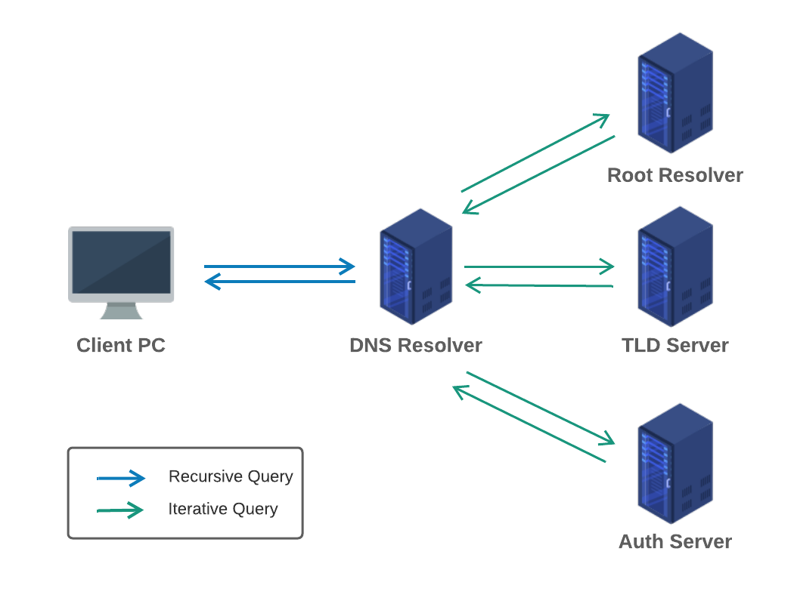
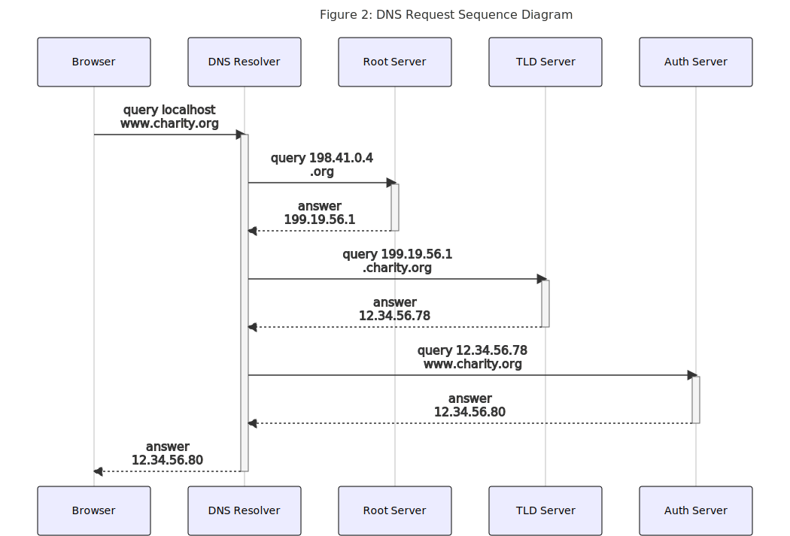
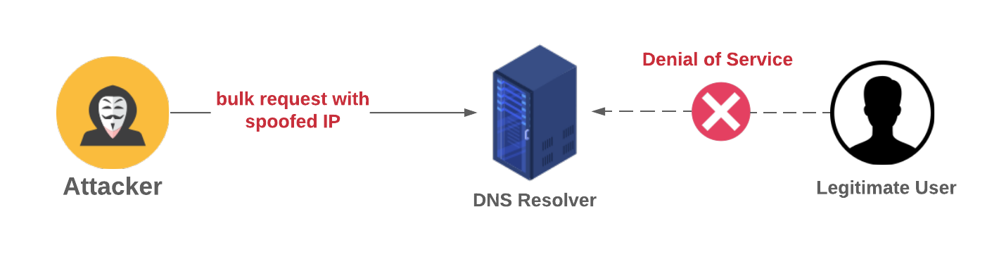
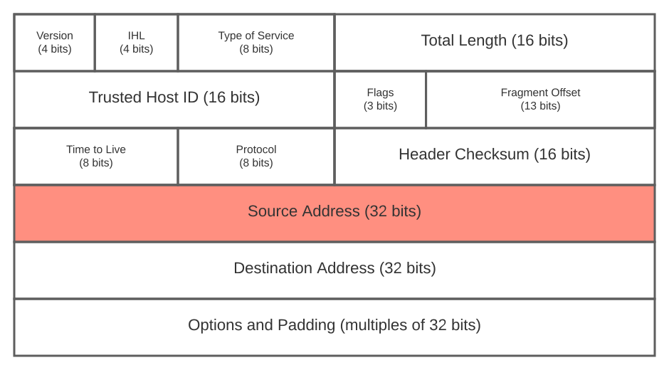

# Project Design Report (Group-2)

## CSE406: Computer Security Sessional

| Student ID |       Student Name       |                     Project Title                     |
| :--------: | :----------------------: | :---------------------------------------------------: |
|  1605002   |    Md. Zawad Abdullah    |    Packet Sniffing Attack and Sniff HTTP Passwords    |
|  1605023   | Ajmain Yasar Ahmed Sahil |       Port Scanning with OS Information/version       |
|  1605024   |   Md. Mahir Shahriyar    | DoS Attack to the DNS Server Using Spoofed IP Address |

## Table of Contents

[toc]

# Packet Sniffing and Sniffing HTTP Passwords

## 1. Definition

### 1.1 Packet Receiving and Processing

All the machines connected to a network interact with it through their Network Interface Cards (NIC). Each NIC has a hardware address called MAC address used to uniquely identify it. Common LANs like Ethernet and WiFi are broadcast medium by nature, which means all the machines are connected to a single shared medium. Each NIC on the network can detect all the frames flowing across the medium. When a NIC receives a frame through the medium, the frame is processed through the following steps:

1. NIC receives a frame and stores it in its internal memory. 
2. The destination address in the frame is matched with the MAC address of the NIC. If they don't match, the frame is not intended for this machine and hence it is discarded.
3. If they do match, the frame is further copied into a buffer in the kernel called Ring buffer. 
4. The NIC invokes an interrupt to inform the CPU about the arrival of this packet.
5. The CPU copies all the packets from the buffer into a queue, clearing the buffer.
6. Kernel invokes different callback handler functions to process different packets.
7. Handler functions dispatches the packets to appropriate user-space programs.

As mentioned above, packets whose destination address don't match with the MAC address of the NIC are discarded by default. But most of the network interface cards support a special mode called *promiscuous mode*. When this mode is activated in a wired network, NIC forwards all received frames to the kernel. A user program can be registered with the kernel to receive all these frames.

In a wireless network,. this is slightly different . Wireless devices face interference from nearby devices which can harm network performance. To avoid this, they transmit data on different channels. An NIC listens to data flowing across only one channel set up in its configuration. To get all the packets flowing across a channel, an NIC can activate a special mode called *monitor mode* (similar to promiscuous mode in wired networks). Unfortunately, most wireless NICs don't support monitor mode.

### 1.2 Packet Sniffing

Packet sniffing is the process of capturing live data packets as they flow across a network. Usually network administrators use it to analyze network characteristics and troubleshoot network problems. But an attacker can also use it to eavesdrop on confidential data and gain sensitive information. When packet sniffing is used for exploitation purposes, it is called packet sniffing attack.

Packet sniffing can be executed by putting the NIC of a machine into promiscuous mode and writing a user program to get all the packets flowing across a network (explained in section 1.1)

By nature, http requests and responses are not encrypted. So if confidential information like username/password is transmitted using http, an attacker machine on the same network can capture the corresponding packet and gain access to the data. In this way, hackers can employ packet sniffing attack to hack http passwords.

## 2. Timing Diagram

## 3. Frame Details

My attacking program will receive an ethernet frame from the NIC via kernel. Then I will remove the ethernet header, IP header, TCP header and finally the HTTP header. After that, I can check if the remaining http message contains my desired information. As I don't need to spoof any packet, no modification in any header is required.

 
 

## 4. Justification

In my program, I will first first activate the promiscuous mode in the NIC. Hence it will forward all packets flowing across the network to the kernel. Then I will create a raw socket configured to get all the packets containing http data. Next I will remove the lower-level protocol headers and get the http message. If the victim is not using https, my program will get the data unencrypted and it will be able to print the (confidential) information in the message. Thus the attack will be successful.

# Port Scanning with OS Information/Version

## 1. What is Port Scanning?

**TCP/IP (Transmission Control Protocol/Internet Protocol)** is the internet protocol suite which is the conceptual model and set of communication protocols used in the Internet and similar computer networks. In TCP/IP model, there is a notion of **IP Address** which is a **Layer-3/Network-layer Address** and used to reference **Server/Host Machines** in networks. In addition to IP address, there is also a notion of **Port** which is a **Layer-4/Transport-layer Address** and used to connect and get services  from specific application running on a server/host machine in the network.  

**Port scanning** is a systematic approach to probe a server/host machine for **Open Ports**. It, itself, is not a **Network-level Threat**. Network administrators may do port scanning to verify security policy of the network for improving overall security posture of the organizational network. But, attackers may also do port scanning to identify network services running on a server/host machine and exploit their **Vulnerabilities**. The attackers use port scanning as a vehicle for carrying out **Reconnaissance Attack**, that is, they try to get information about a particular network so that they can identify how the  network may behave if **Malicious Connections** are made. If they can find an open port corresponding to a specific service and the vulnerability of that service is known, then they can attack that service via open port.  

## 2. Ports on a Server/Host Machine

Usually, 16 bits are used to encode and identify **Port Number** on a server/host machine. Therefore, there are  216 = 65,536 possible ports. But, `port 0` is left unassigned and used by **Operating System** to accept request for allocating and opening any currently unused port. Hence, there are, in total, 216-1 = 65,535 ports on a server/host machine.  

Most **Internet applications** run on **Well-defined Ports**. Example of associations between Internet applications and server/host machine ports is given below:  

| Port Number | Internet Application Running         |
| ----------- | :----------------------------------- |
| `port 21`   | FTP (File Transfer Protocol)         |
| `port 22`   | SSH (Secure Shell Protocol)          |
| `port 23`   | Telnet Protocol                      |
| `port 25`   | SMTP (Simple Mail Transfer Protocol) |
| `port 53`   | DNS (Domain Name System)             |
| `port 80`   | HTTP (Hypertext Transfer Protocol)   |
| `port 443`  | HTTPS (HTTP Secure)                  |
| `port 1433` | SQL Server                           |

Normally, all ports on a server/host machine are not scanned during port scanning. Instead, ports with known applications running or known exploitable vulnerabilities are cherry-picked and scanned.  

Typically, port scanning works by trying to **Systematically** establish connections to all available ports on a given server/host machine. When such an attempt to establish connections is made, one may get one of the three different types of **Responses** from the corresponding port on server/host machine. These responses are:  

1. `open/accepted`: service in question is **Listening for New Connections** on specified port  
2. `closed/denied`: service in question is **Not Listening for New Connections** on specified port  
3. `filtered/dropped/blocked`: **No Reply** from specified port running service in question  

## 3. Implementation  

There are many techniques that are typically used to implement port scanning. These techniques are discussed in the following subsections.  

### 3.1 TCP `connect()` (Full-open) Port Scanning  

This is the most common and simplest technique used in port scanning implementation. **TCP** `connect()` is a **System Command** used to establish connection with server/host machine through a port. The connection is established via a **Three-way Handshaking** scheme as depicted in the above diagram.  

### 3.2 TCP `SYN` (Half-open) Port Scanning  

**TCP** `SYN` port scanning works in a similar fashion to **TCP** `connect()` port scanning. The difference is that after receiving `SYN+ACK` from server/host machine, the attacker responds with **TCP** `RST` instead of **TCP** `ACK` to terminate the connection.  

### 3.3 TCP `connect()` Port Scanning vs TCP `SYN` Port Scanning

The problems with TCP `connect()` port scanning are discussed below:  

- During TCP three-way handshaking, server/host machine allocates some space in its memory to store details on the connection at targeted port and state of the three-way handshaking. If attacker stops responding and does not complete TCP three-way handshaking, then server/host machine will not release previously allocated memory for that connection. Eventually, server/host machine may run out of memory and stop working.  
- From attacker's perspective, an attempt to scan a port on server/host machine should go unnoticed. **IPS (Intrusion Prevention System)** looks for number of ports on server/host machine with fully established connection (connection established via three-way handshaking) and decides on whether the machine is a victim of port scanning attack. Hence, completing three-way handshake risks the port scanning detection.  
- As soon as the three-way handshake is completed, the application running on the targeted port takes control of the established connection. Consequently, the application as well as the entire server/host machine may crash if attacker tries to abruptly terminate the connection.  

Therefore, an attacker may not prefer TCP `connect()` port scanning. TCP `SYN` port scanning tackles the issue with TCP `connect()` port scanning.  

### 3.4 Other Port Scanning Implementation Techniques  

#### 3.4.1 TCP `FIN` Port Scanning

Often, **Firewall** and **Packet Filters** monitor specified ports so that the previously mentioned techniques of TCP port scanning  can be detected. To bypass this detection, **TCP Packet with FIN Flag** may be used. Usually, this packet is used to finish an established connection with server/host machine. If TCP FIN packet is sent before establishing a connection, an open port discards the packet and a closed port replies with a **TCP Packet with RST Flag**. So, open and closed ports can be distinguished between by looking at the TCP RST reply from the target port on server/host machine. Though some systems, regardless of whether the port is open, reply to TCP FIN packet with TCP RST packet to prevent this type of scanning method, TCP FIN port scanning may come in handy for many systems.  

#### 3.4.2 UDP Raw ICMP Port Unreachable Scanning  

This port scanning implementation technique differs from the aforementioned techniques in that it uses **UDP (User Datagram Protocol)** instead of TCP. While this protocol is simpler compared to TCP, scanning with this protocol is significantly more difficult. This is because open ports are not obliged to send an acknowledgement in response to the scanning probe and close ports are not even required to send an error packet. Fortunately, most server/host machines do send an `ICMP_PORT_UNREACH` error when a packet is sent to a closed UDP port. Thus, open and closed ports can be distinguished between by looking at the receipt of `ICMP_PORT_UNREACH` error. Again, neither UDP packet nor **ICMP (Internet Control Message Protocol) Error** are guaranteed to arrive. So, UDP port scanner of this type must also implement **Packet Retransmission Mechanism**. This port scanning implementation technique is very slow. Again, this technique requires the attacker to have **Root Privileges**.  

#### 3.4.3 UDP `recvfrom()` and `write()` Port Scanning

An attacker without root privileges can not read `ICMP_PORT_UNREACH` error directly. But, **Linux** can indirectly notify the attacker when the error arrives. This port scanning implementation technique is used to check whether the port is open.  

The reason behind so many implementation techniques for port scanning being developed by attackers is that any of these techniques may potentially get detected by network security systems like **IDS (Intrusion Detection System)**, **Firewall**, etc. Therefore, many implementation techniques for port scanning have been developed over the time so that an attacker can successfully bypass the detection and carry out the desired attack on server/host machine. Each of these implementation techniques has its own subtle method along with pros and cons.  

## 4. OS Information/Version Detection  

Sometimes, inside a network, it is beneficial to know the **Operating System (OS)** of a server/host machine. Accessing a machine is easier when the OS it is running on is known to the attacker because attacker can, then, specifically search for known **Security Vulnerabilities** in that OS. Though, these security vulnerabilities are usually patched quickly, but the attacker just needs to know when and where a certain security vulnerability exists.  

### 4.1 OS Detection Database  

Each OS has unique characteristics associated with its **TCP/IP Stack Implementation** which may serve to identify the OS in a network. **TCP/IP Stack Fingerprinting** is the passive collection of configuration attributes from a **Remote** server/host machine during **Standard Transport Layer (Layer 4) Network Communications**. The combination of attributes may then be used to infer the OS running on that remote machine (known as **OS Fingerprinting**). There are many techniques and methods for getting a **Good Estimate** of the OS running on a certain remote server/host machine. Two of these techniques and methods are discussed in the following subsections.  

#### 4.1.1 Active Fingerprinting  

**Special Probe Packets** are sent to certain server/host machine and based on the response from that remote machine, certain OS is assumed to be running on that machine.  

#### 4.1.2 Passive Fingerprinting  

**Legitimate Traffic** is analyzed and then, compared for certain key differences in the TCP/IP stack implementation on different types and versions of OS.  

**NMAP (Network Mapper)** is a free and open-source **Network Scanner** created by *Gordon Lyon*. This tool offers a **Database** which is installed together with NMAP. This database is named `nmap-os-db` and used when carrying out OS detection through OS fingerprinting. This database does not automatically get updated. The updated version can be found on the Internet from [svn.nmap.org/nmap/nmap-os-db](https://svn.nmap.org/nmap/nmap-os-db).  

### 4.2 OS Detection Process  

There are five different **Probes** being performed during OS fingerprinting. Each of these probes may consist of one or more **Packets**. The response to each packet from the target server/host machine helps the attacker to estimate the type and version of OS. The five different probes are discussed in the following subsections.  

#### 4.2.1 Sequence Generation  

The **Sequence Generation Probe** consists of six packets. These packets are all **TCP `SYN` Packets** and sent 100 milliseconds apart from one another. The response for each TCP SYN packet contributes to estimating the type and version of OS.  

#### 4.2.2 ICMP Echo  

The **ICMP Echo Probe** consists of two packets. These packets are sent to the target server/host machine with varying settings. The responses contribute to verifying the type and version of OS.  

#### 4.2.3 TCP Explicit Congestion Notification  

When many packets are being generated and passing via certain router, the router becomes burdened and this situation is known as **Congestion**. Consequently, server/host machine slows down to reduce congestion so the router can stop dropping packets. Remote machine responds only for delivered packets. Since each OS handles these packets in different ways, specific values returned contribute to estimating the type and version of OS running on remote machine.  

#### 4.2.4 TCP  

The **TCP Probe** consists of six packets. Each packet is sent to either open or closed port on remote server/host machine with specific settings. Responds from remote machine vary depending on the OS running on it. The **TCP Packets** are all sent with varying **Flags** as follows:  

1.  No Flags  
2.  `URG`, `PSH`, `SYN`, and `FIN`  
3.  `ACK`  
4.  `SYN`  
5.  `ACK`  
6.  `URG`, `PSH`, and `FIN`  

  

#### 4.2.5 UDP  

The **UDP Probe** consists of a single packet sent to a closed port on remote server/host machine. If that port on the target machine is closed and an **ICMP Port Unreachable Message** is returned, then there is no firewall deployed on server/host side.  

## 5. Why These Attacks Work  

**Port Scanning** is a common technique used by the attackers to go and discover open ports on a remote server/host machine so that they can exploit the services with known vulnerabilities running on those ports. This attack can also reveal whether active network security measures like firewalls are being deployed in an organizational network.  

On the other hand, **OS Fingerprinting** is the process used by the attackers to infer the type and version of OS running on a target server/host machine so that they can easily exploit the vulnerabilities associated with that OS.  

These attacks are carried out by sending trivial networking packets from attackers to victim server/host machine. As a result, it becomes quite difficult for the active network security measures to distinguish between normal network traffic and malicious network traffic. Also, many implementation techniques have been developed over the years for carrying out these attacks. As a result, attackers have an arsenal of attacking methods at their disposal to bypass detection by these active network security measures.

# DoS Attack to the DNS Server Using Spoofed IP Address

## 1. Definition

In this section, we present the definition and mechanisms of some terms used in the project.

#### 1.1 DoS Attack

A **denial-of-service (DoS) attack** is a type of attack that tries to shut down or slow down a machine or a network, making it inaccessible to its intended users. The attack is accomplished usually by **flooding** the server with large traffics.

*   The system receives way more traffic than its server can handle causing it to slow down. In some cases, this might even lead to server shutdown.

The purpose of this attack is usually not to steal information from the network but to make the service slow or unavailable to its legitimate users. DoS attack has a wide range of variety based on the way the attack is accomplished. Some popular ways of performing DoS attacks are listed below: 

1.  **Buffer Overflow:** This the most common form of DoS attack. The attackers send more traffic to a network address than the programmers have built the system to handle.
2.  **ICMP flood:** Instead of attacking one specific machine, attackers send spoofed packets that ping every computer on the targeted network. Also known as the smurf attack or the ping of death.
3.  **SYN flood:** Attackers continue to send requests to every port of the server but never completes the **three-way handshake**. Eventually intended users get deprived of the service as all the ports of the server get clogged.

#### 1.2 DNS Server

A **DNS (Domain Name System) Server** is a type of server that translates domain names to their correct IP address. Whenever a user types a web address in the browser the responsible DNS server fetches the correct IP and serves it to the client.

**Resolving DNS query:** There are mainly four servers that work together to resolve a DNS query:

1.  **DNS Resolver:** Receives query from client and interacts with other DNS servers to fetch the correct IP. Next, the resolver queries the root server.
2.  **Root Server:** Receives query from the resolver and responds with the address of the Top Level Domain(**TLD**) DNS server that stores the information for its domain. Next, the resolver queries the TLD Server.

3.  **TLD Server:** Receives query from the resolver and responds with the IP address of the domain's authoritative server. Next, the resolver queries the authoritative server. 
4.  **Authoritative Server:** Receives query from the resolver and responds with the IP address of the origin server. The resolver then finally passes the IP address back to the client.

<figure style="text-align: center">
	
    <figcaption>Figure 1: DNS Lookup</figcaption>
</figure>

Using the resolved IP address, the client finally interacts directly with the origin server.

#### 1.3 IP Spoofing

Attackers create IP packets modifying the source address in the header to hide their identity. This process is called **IP spoofing**. In general, all IP packets contain the client's IP in their header. With this, the server can identify the client of this packet. DoS attacks can be prevented if the server can detect which IP is generating the flooding traffic and take measures by blocking that IP i.e. no further requests shall be processed from that source. To get around this, attackers forge the IP header before sending it. Upon receiving, the server would have no way of differentiating the attacker from the legitimate users.

## 2. DNS Request Sequence Diagram

Given that no caching is done, four servers work together to resolve a single DNS request as stated in the previous section. There are typically two strategies adopted to resolve a DNS request: 

1.  **Recursive Approach:**  A DNS server recursively continues querying other DNS servers until it has an IP address to return to the client. Normally, the query between a DNS client and its local DNS server is done recursively. The local DNS server fetches the requested IP for the client.
2.  **Iterative Approach:** In the iterative approach when a DNS server receives a request it responds with an address of another DNS server to ask. The client then continues querying the referred DNS servers until one of them responds with the correct IP address of the requested domain name. The interaction between the DNS resolver and other DNS servers is iterative.

Below we show the sequence diagram for a DNS request from the client (web-browser):

<figure style="text-align: center">
	
</figure>

To implement a basic DoS attack on the DNS servers, our primary target would be to repeatedly send requests to the DNS resolver so that it fails to serve its legitimate users. We would also spoof the source-IP of our request so that the DNS server fails to detect the actual attacker.

<figure style="text-align: center">
	
    <figcaption>Figure 3: DoS attack to the DNS server</figcaption>
</figure>

## 3. Modification in the Packet Header

To implement DoS using spoofed IP we need to manipulate the IP header of our packets before sending them to the DNS server. The actual structure of a packet that goes out of the machine is somewhat like the following:

<figure style="text-align: center">
	
    <figcaption>Figure 4: Data Encapsulation</figcaption>
</figure>

The source IP address of the client's computer lies within the IP header. The structure of the IP header is as follows:

<figure style="text-align: center">
	
    <figcaption>Figure 5: IP header</figcaption>
</figure>

As we can see, to accomplish the DoS attack with spoofed IP we cannot let the kernel set the source IP address for us. Rather we would have to forge it ourselves.

## 4. Justification of Design

I think the DoS attack would go successfully if the attacker can generate a large number of requests to the DNS server. The main challenge would be to manipulate the IP header and spoof the source IP. If successfully done so, the DNS server would have no way of differentiating the attacker from other legitimate users.

Hence, I believe my design would work perfectly for this project.
